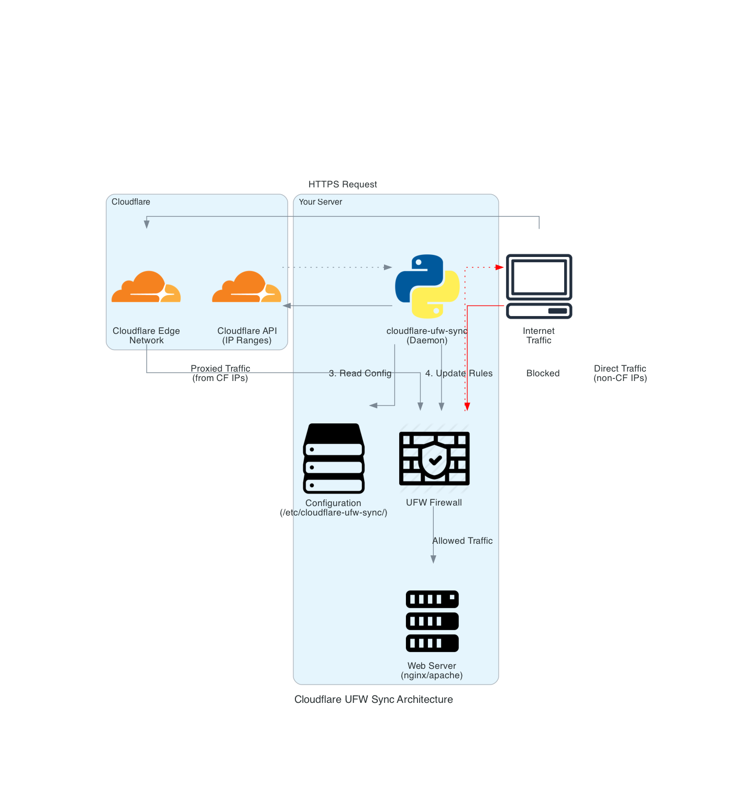

# Cloudflare UFW Sync

[](https://www.python.org/downloads/)
[](https://opensource.org/licenses/MIT)
[](https://github.com/psf/black)
[](https://github.com/thomasvincent/cloudflare-ufw-sync/actions/workflows/tests.yml)
[](https://pypi.org/project/cloudflare-ufw-sync/)

Enterprise-grade Cloudflare IP synchronization for UFW.

## Overview

`cloudflare-ufw-sync` is a robust tool designed to automatically synchronize Cloudflare's IP ranges with your UFW (Uncomplicated Firewall) rules. This ensures that only traffic coming from Cloudflare's network is allowed to access your web server.

## Architecture



## Features

- 🔄 Automatic synchronization of Cloudflare IP ranges with UFW rules
- 🔒 Securely manages UFW rules with proper permission handling
- 🛠️ Supports both IPv4 and IPv6 address ranges
- 🔍 Detailed logging for audit and troubleshooting
- 🔧 Customizable configuration
- 🧪 Comprehensive test suite

## Installation

### From PyPI

```bash
pip install cloudflare-ufw-sync
```

### From Source

```bash
git clone https://github.com/thomasvincent/cloudflare-ufw-sync.git
cd cloudflare-ufw-sync
pip install .
```

## Configuration

Create a configuration file at `/etc/cloudflare-ufw-sync/config.yml` or `~/.config/cloudflare-ufw-sync/config.yml`:

```yaml
cloudflare:
  api_key: your-api-key  # Optional: Only needed if using authenticated endpoints
  ip_types:
    - v4  # IPv4 addresses
    - v6  # IPv6 addresses

ufw:
  default_policy: deny
  port: 443  # The port to allow access to
  proto: tcp  # Protocol (tcp, udp, or both)
  comment: "Cloudflare IP"  # Comment for UFW rules

sync:
  interval: 86400  # Sync interval in seconds (default: 1 day)
  enabled: true
```

## Usage

### Command Line

```bash
# Run a sync operation
cloudflare-ufw-sync sync

# Run in daemon mode
cloudflare-ufw-sync daemon

# View current status
cloudflare-ufw-sync status
```

### As a Service

A systemd service file is provided to run the synchronization as a service:

```bash
sudo cp scripts/cloudflare-ufw-sync.service /etc/systemd/system/
sudo systemctl daemon-reload
sudo systemctl enable cloudflare-ufw-sync
sudo systemctl start cloudflare-ufw-sync
```

## Development

### Testing with Docker

If you prefer an isolated environment, you can build and run the test suite entirely in Docker.

```bash
# Build the dev image (includes dev dependencies and package in editable mode)
docker build -t cloudflare-ufw-sync:dev .

# Run tests with pytest (quiet mode, stop on first failure)
docker run --rm -t --entrypoint pytest cloudflare-ufw-sync:dev -q --maxfail=1 --disable-warnings
```

This is the exact setup used in CI and by maintainers when sanity-checking changes locally.

### Make targets

For convenience, a few make targets mirror the Docker workflow:

```bash
# Build the dev image
make docker-build

# Run the test suite inside the container
make docker-test

# Run tox (lint + mypy per tox.ini) inside the container
make docker-tox
```

### Setup

```bash
# Clone the repository
git clone https://github.com/thomasvincent/cloudflare-ufw-sync.git
cd cloudflare-ufw-sync

# Set up a virtual environment
python -m venv venv
source venv/bin/activate

# Install dev dependencies
pip install -e ".[dev]"
```

### Testing and Linting with Tox

The project includes a `tox.ini` file that sets up environments for testing, linting, and type checking. This allows you to run the same checks locally that are performed in the CI pipeline before committing your changes.

```bash
# Install tox
pip install tox

# Run all tests and checks on all supported Python versions
tox

# Run tests for a specific Python version
tox -e py38  # For Python 3.8
tox -e py39  # For Python 3.9
tox -e py310 # For Python 3.10
tox -e py311 # For Python 3.11
tox -e py312 # For Python 3.12

# Run only linting checks
tox -e lint

# Run only type checking
tox -e mypy

# Format code
tox -e format
```

### Manual Testing

If you prefer to run tests and linting manually:

```bash
# Run tests
pytest

# Run linting
black .
isort .
flake8

# Run type checking
mypy src
```

## License

This project is licensed under the MIT License - see the [LICENSE](LICENSE) file for details.

## Security

See [SECURITY.md](SECURITY.md) for security policy and reporting vulnerabilities.

## Contributing

Contributions are welcome! Please feel free to submit a Pull Request.